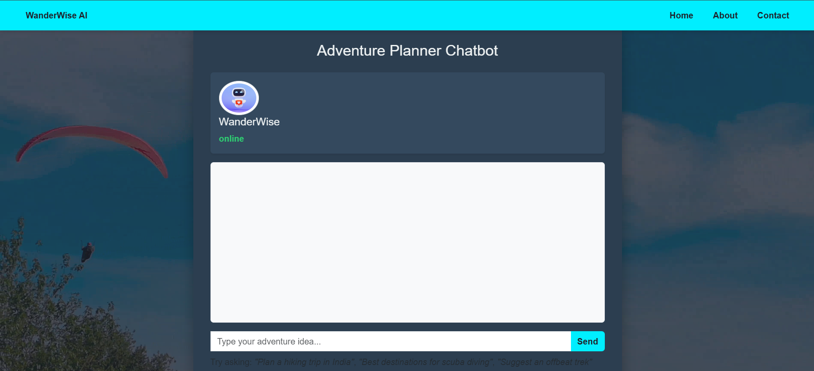
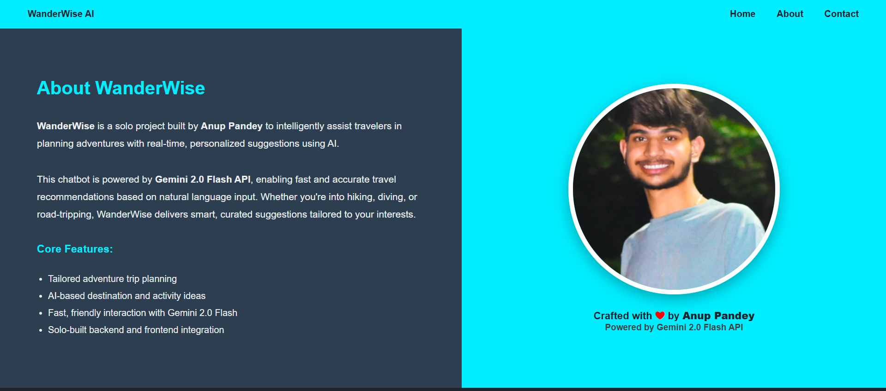

# 🌍 WanderWise AI – Adventure Planner Chatbot

[](https://wanderwise-ai-chatbot.onrender.com)
[](https://nodejs.org/)
[](LICENSE)

**WanderWise** is an AI-powered adventure planner chatbot that helps travelers discover new destinations, plan exciting activities, and create personalized itineraries.  
Built with ❤️ by **Anup Pandey**, this project integrates **Google Gemini 2.0 Flash API** to deliver real-time, intelligent trip planning suggestions.

---

## 🌐 Live Demo

👉 **Experience it here:**  
🔗 [https://wanderwise-ai-chatbot.onrender.com](https://wanderwise-ai-chatbot.onrender.com)

---

## 🚀 Features

- 🧭 Personalized adventure trip planning  
- 🏞️ Real-time destination and activity suggestions  
- 🎒 Smart itineraries and travel safety tips  
- 💸 Budget-friendly accommodation and transport ideas  
- ✉️ Contact form powered by **EmailJS**  
- 🌈 Responsive and aesthetic front-end with video background  
- 🤖 AI responses generated using **Gemini 2.0 Flash API**

---

## 🛠️ Tech Stack

| Category | Tools Used |
|-----------|-------------|
| **Frontend** | HTML, CSS, JavaScript, Bootstrap, EJS |
| **Backend** | Node.js, Express.js |
| **AI Integration** | Google Gemini 2.0 Flash API |
| **Email Service** | EmailJS + SweetAlert2 |
| **View Engine** | EJS |
| **Deployment** | Render |

---

## 📁 Project Structure
```
wanderwise-ai/
│
├── index.js
├── .env
├── package.json
│
├── public/
│ ├── css/
│ ├── js/
│ ├── img/
│ └── video/
│
└── views/
└── pages/
├── index.ejs
├── about.ejs
└── contact.ejs
```

---

## ⚙️ Setup Instructions

### 1️⃣ Clone the Repository
```bash
git clone https://github.com/AnupPandey04/WanderWise-AI---chatbot.git
cd WanderWise-AI---chatbot
```
### 2️⃣ Install Dependencies
```bash
npm install
```
### 3️⃣ Configure Environment Variables
Create a .env file in the root directory and add your Gemini API key:
GEMINI_API_KEY=your_google_gemini_api_key_here
### 4️⃣ Run the Server
```bash
node index.js
```
Your chatbot will be available at 👉 http://localhost:3000

---

## 💬 Chatbot Persona

> “I’m **WanderWise** – your intelligent adventure planner.  
> I help you find thrilling destinations, craft perfect itineraries, and make every trip memorable and safe.”

---

## 📸 Screenshots

| Homepage | About | Contact |
|-----------|--------|----------|
|  |  |  |

---

## 🧠 How It Works

1. The user enters a travel-related query (e.g., “Plan a 3-day trek in Manali”).  
2. The request is sent to the backend via **Express.js**.  
3. The backend communicates with **Gemini 2.0 Flash API** to generate contextual replies.  
4. The chatbot dynamically displays the AI-generated response on the screen.

---

## 🧑‍💻 Author

**👋 Anup Pandey**  
💼 *B.Tech CSE | Passionate about AI, Web Development, and Travel Tech*  
🔗 [LinkedIn](https://www.linkedin.com/in/anup-pandey-/)
🌍 [Live Project](https://wanderwise-ai-chatbot.onrender.com)

---

## 🪪 License

This project is licensed under the **MIT License** — feel free to use and modify it.

---

## ⭐ Acknowledgements

- [Google Gemini 2.0 Flash API](https://ai.google.dev/gemini-api)  
- [EmailJS](https://www.emailjs.com/)  
- [Bootstrap](https://getbootstrap.com/)  
- [SweetAlert2](https://sweetalert2.github.io/)  
- [Render Hosting](https://render.com/)

---

> ✨ *Crafted with love by **Anup Pandey** — inspiring smarter, safer, and more adventurous journeys through AI.*

